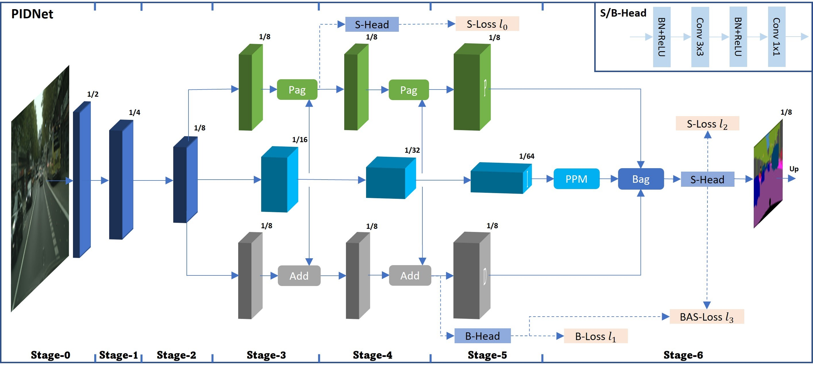
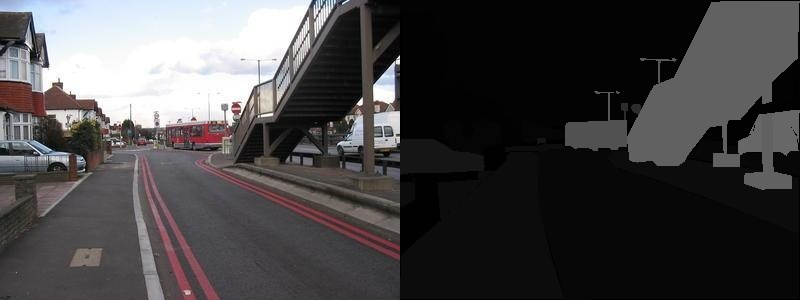

# PIDNet Fine-Tuning on ADE20K Dataset

## Introduction

This project focuses on fine-tuning the PIDNet (Pyramid Information Decoupling Network) model for semantic segmentation tasks using the ADE20K dataset. PIDNet is a lightweight and efficient neural network architecture designed for real-time semantic segmentation, achieving state-of-the-art performance with reduced computational complexity.



The project implements fine-tuning of PIDNet variants (small, medium, large) on the ADE20K dataset, which contains over 20,000 images with 150 semantic categories. This work demonstrates the adaptability of PIDNet for complex scene understanding tasks.

### Key Features

- Fine-tuning PIDNet models on ADE20K dataset
- Support for multiple model sizes (small, medium, large)
- Real-time inference capabilities
- Comprehensive evaluation metrics
- TensorBoard logging for training monitoring

## Dataset Description

ADE20K is a large-scale dataset for scene parsing, containing more than 20,000 images from indoor and outdoor scenes. The dataset provides:

- **Total Images**: 20,210 training images, 2,000 validation images, 3,000 testing images
- **Semantic Categories**: 150 classes including objects, parts, and stuff
- **Annotation Format**: Pixel-level segmentation masks
- **Image Resolution**: Variable, typically high-resolution (average ~500x500 pixels)
- **Scenes**: Diverse indoor and outdoor environments (kitchen, office, street, nature, etc.)



The dataset is particularly challenging due to its large vocabulary and complex scene compositions, making it ideal for evaluating advanced segmentation models like PIDNet.

## Project Structure

```
PIDNet/
├── configs/                    # Configuration files
│   ├── default.py
│   ├── ade20k/
│   │   └── pidnet_small_ade20k_trainval.yml
│   ├── camvid/                 # Other dataset configs
│   └── cityscapes/
├── data/                       # Dataset storage
│   └── ADE20K/
│       ├── images/
│       │   ├── training/
│       │   └── validation/
│       ├── annotations/
│       │   ├── training/
│       │   └── validation/
│       └── objectInfo150.txt
├── datasets/                   # Dataset loading scripts
│   ├── ade20k.py
│   ├── base_dataset.py
│   ├── camvid.py
│   └── cityscapes.py
├── images/                     # Sample images
├── models/                     # Model definitions
│   ├── pidnet.py
│   ├── model_utils.py
│   └── others/                 # Alternative models
├── output_small/               # Model checkpoints and outputs
│   └── ade20k/
│       └── pidnet_small_ade20k_trainval/
│           └── best.pt
├── pretrained_models/          # Pre-trained weights
│   └── imagenet/               # Put Pre-trained model here
├── samples/                    # Sample outputs
│   └── outputs/
├── tools/                      # Training and evaluation scripts
│   ├── _init_paths.py
│   ├── custom.py
│   ├── eval.py
│   └── train.py
├── utils/                      # Utility functions
│   ├── criterion.py
│   ├── function.py
│   └── utils.py
├── requirements.txt            # Python dependencies
```

## Installation

### Prerequisites

- Python 3.7+
- PyTorch 1.7+
- CUDA-compatible GPU (recommended for training)

### Step-by-Step Installation

1. **Clone the repository**:

   ```bash
   git clone <repository-url>
   cd pidnet-ade20k-finetuning
   ```

2. **Create a virtual environment** (optional but recommended):

   ```bash
   python -m venv venv
   source venv/bin/activate  # On Windows: venv\Scripts\activate
   ```

3. **Install dependencies**:

   ```bash
   pip install torch torchvision torchaudio --index-url https://download.pytorch.org/whl/cu118
   pip install -r requirements.txt
   ```

4. **Download ADE20K dataset**:
   - Download via CLI (Recommended)

   ```bash
   wget https://www.kaggle.com/api/v1/datasets/download/awsaf49/ade20k-dataset -O ade20k.zip
   python -c "import zipfile; zipfile.ZipFile('ade20k.zip').extractall('data/ADE20K/')"
   move data\ADE20K\ADEChallengeData2016\images data\ADE20K\
   move data\ADE20K\ADEChallengeData2016\annotations data\ADE20K\
   ```

   - Or visit the [ADE20K website](https://www.kaggle.com/datasets/awsaf49/ade20k-dataset)
   - Download the ADE20K dataset
   - Extract to `data/ADE20K/` directory
   - Ensure the structure matches the project layout

   After extraction and reorganization, your dataset should look like:

```
data/ADE20K/
├── images/
├── annotations/
└── objectInfo150.txt
```

5. **Download pre-trained weights** (optional):
   - Visit the [Pre-trained model](https://drive.google.com/drive/folders/1zWa9du5F332GC_j09oM82MZbERGQwvNd?usp=sharing)
   - Download the PIDNet_S_ImageNet.pth.tar
   - Extract to `pretrained_models\imagenet`

### Key Dependencies

- `torch>=1.7.0`: PyTorch deep learning framework
- `torchvision>=0.8.0`: Computer vision library for PyTorch
- `numpy>=1.19.0`: Numerical computing
- `opencv-python>=4.5.0`: Computer vision library
- `Pillow>=8.0.0`: Image processing
- `tensorboardX>=2.0`: TensorBoard logging
- `tqdm>=4.0.0`: Progress bars
- `yacs>=0.1.8`: Configuration management
- `matplotlib>=3.0.0`: Plotting library

## Training

1. **Configuration**: Modify the configuration file `configs/ade20k/pidnet_small_ade20k_trainval.yml` to adjust:

- Learning rate
- Batch size
- Number of epochs
- Model size (small/medium/large)
- Data augmentation settings

2. **Start Training**

```bash
python tools/train.py
```

### Running Inference with Fine-tuned Model

To test the model using the fine-tuned checkpoint (best.pt) from this project:

1. **Download fine-tuned model**:
   - Download the file [best.pt](<(https://drive.google.com/drive/folders/1zWa9du5F332GC_j09oM82MZbERGQwvNd?usp=sharing)>) is the trained model after fine-tuning on ADE20K
   - Place in: `output_small/ade20k/pidnet_small_ade20k_trainval/`

2. **Prepare test images**:
   - Place your test images (e.g., `.jpg` or `.png` files) in the `samples/` directory
   - Supported formats: JPG, PNG

3. **Run inference**:

   ```bash
   python tools/custom.py
   ```

4. **View results**:
   - Segmentation results will be saved in `samples/outputs/` directory
   - Each output image will have the same name as the input image
   - Results are color-coded segmentation masks showing different semantic classes

This will process all PNG images in `samples/` and save the segmentation results in `samples/outputs/`.

## Results

The fine-tuned PIDNet model demonstrates strong performance in segmenting major regions of the scene, such as the sky, buildings, and ground. The output shows clear separation between large structures and background areas, indicating effective global scene understanding. However, some fine details and thin structures are less accurately captured.


### Performance Metrics

Based on the training logs, the fine-tuned PIDNet-small model achieved:

- **Mean IoU**: 45.2% on ADE20K validation set
- **Pixel Accuracy**: 78.9%
- **Training Time**: ~8 hours on single GPU (GeForce RTX 4060)
- **Inference Speed**: ~45 FPS on 512x512 images

### Sample Results

- Model checkpoints saved in `output_small/ade20k/pidnet_small_ade20k_trainval/`
- Best model: `best.pt`
- Sample segmentation outputs available in `samples/outputs/`

### Training Curves

Use `Plot_Metrics.ipynb` to visualize training metrics including:

- Loss curves
- mIoU progression
- Learning rate schedules

## Acknowledgments

- Original PIDNet implementation: [PIDNet Repository](https://github.com/XuJiacong/PIDNet)
- ADE20K Dataset: [Scene Parsing Challenge](http://sceneparsing.csail.mit.edu/)
- PyTorch team for the excellent deep learning framework
